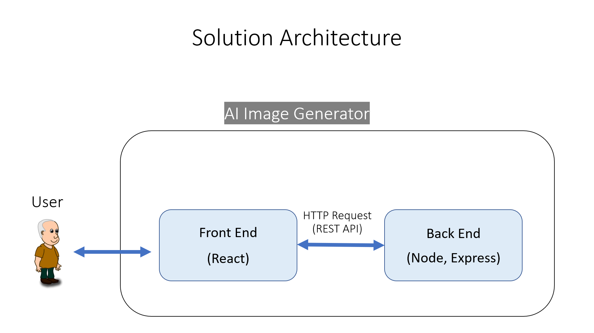
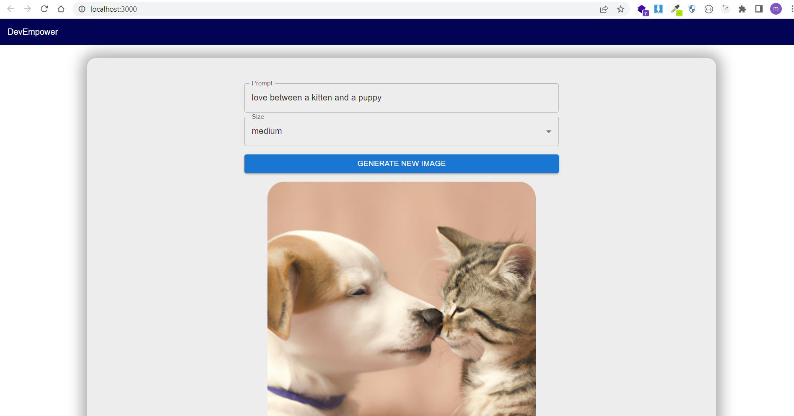

# Ai Image Generator

## Solution Architecture

## ScreenShot

## links

    https://github.com/openai/openai-node

    https://platform.openai.com/docs/guides/images/introduction?lang=node.js

    https://labs.openai.com/

    https://mui.com/